# 🐾 Meow Operations

> **Local-first AI observability and loop engineering for people who live inside agentic coding tools.**

Meow Operations turns local Claude Code, OpenAI Codex Desktop, Aider, Cursor, and Google Antigravity activity into an installable PWA. It combines token/cost analytics, source comparison, live agent timelines, a Loop Ops control room, evidence-backed review queues, optional guarded execution, a Pomodoro focus timer, and a living 3D cat companion. No required account. No telemetry. MIT-licensed.

## Screenshots

<table>
  <tr>
    <td width="50%">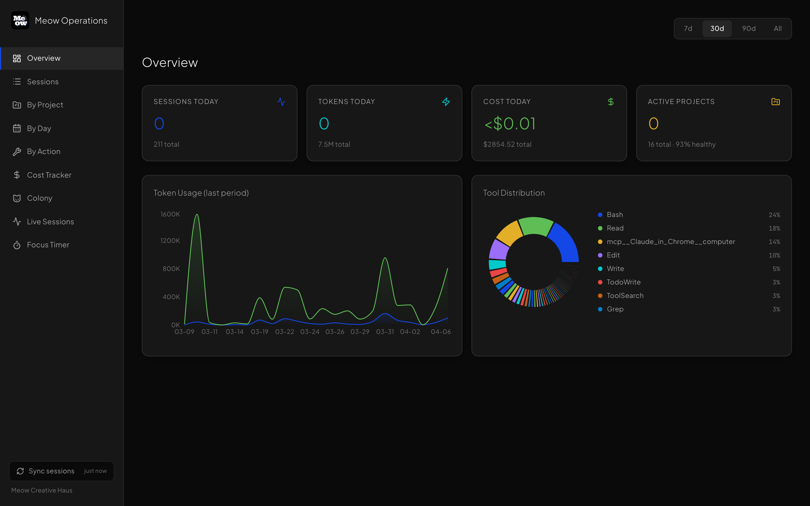</td>
    <td width="50%">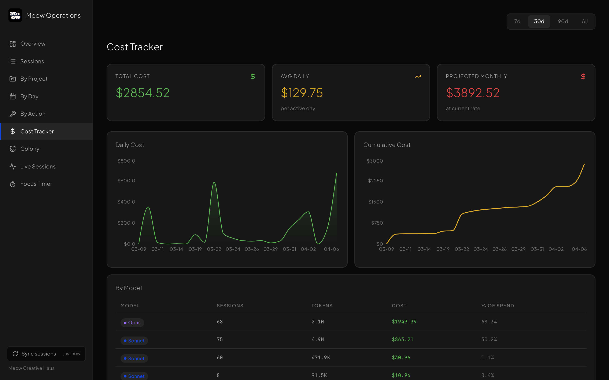</td>
  </tr>
  <tr>
    <td><strong>Overview</strong><br>Sessions, spend, tokens, tool mix, and source split in one view.</td>
    <td><strong>Cost Tracker</strong><br>Daily cost, cumulative burn, and model-level spend breakdowns.</td>
  </tr>
  <tr>
    <td width="50%">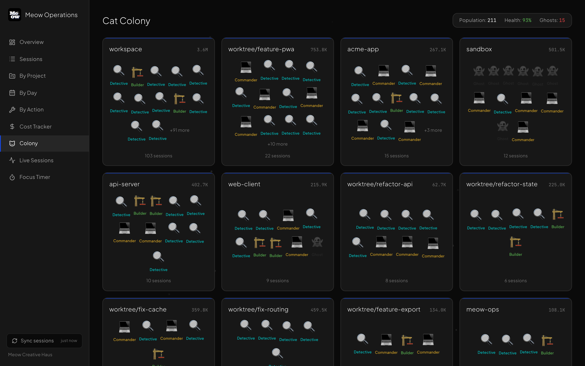</td>
    <td width="50%">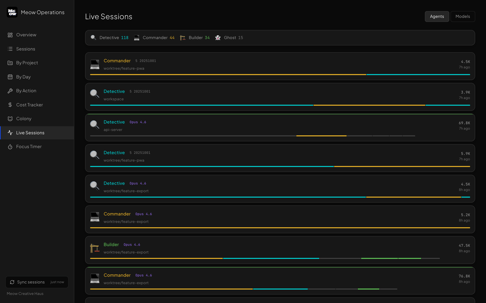</td>
  </tr>
  <tr>
    <td><strong>Cat Companion</strong><br>A WebGL companion that evolves from your actual work pattern.</td>
    <td><strong>Live Sessions</strong><br>Real-time cards for active agent work and tool usage.</td>
  </tr>
  <tr>
    <td width="50%">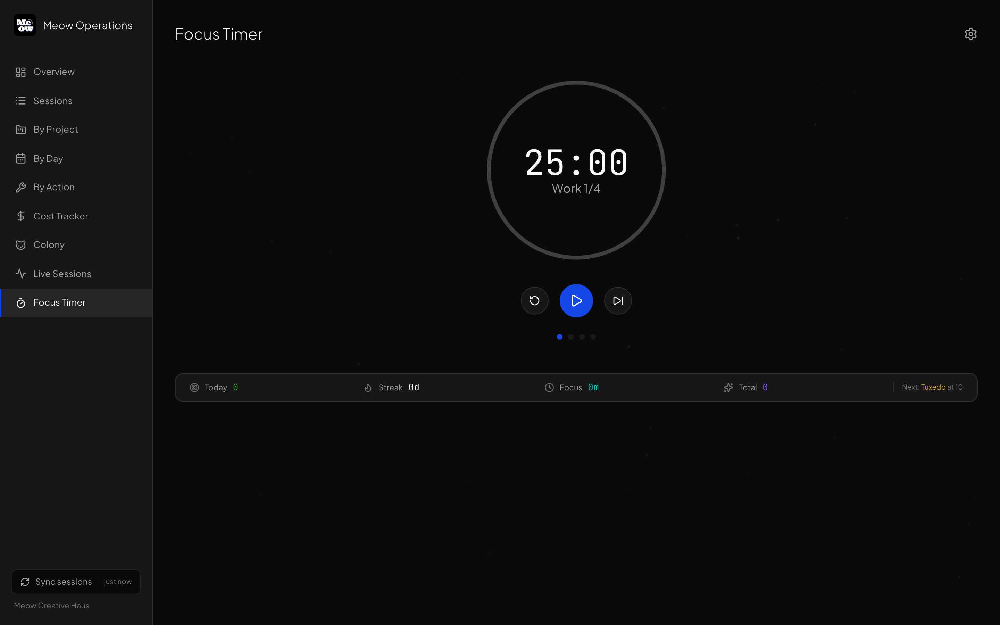</td>
    <td width="50%">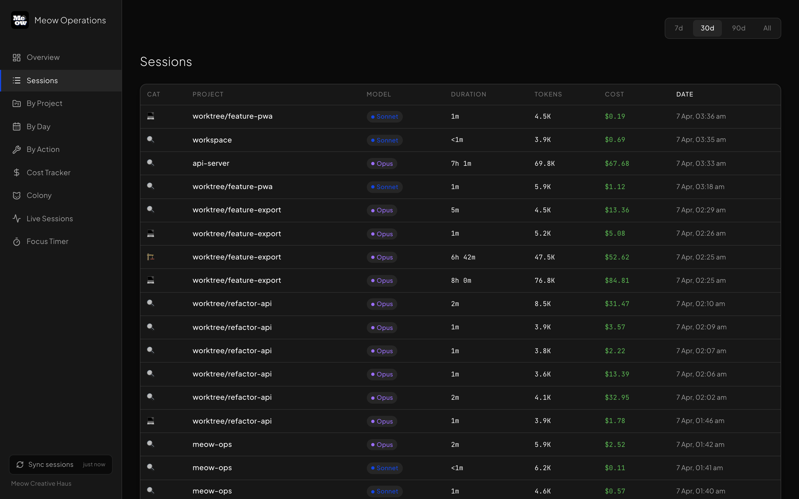</td>
  </tr>
  <tr>
    <td><strong>Focus Timer</strong><br>Pomodoro flow with cat breeds, streaks, and local-only state.</td>
    <td><strong>Sessions</strong><br>Sortable session table with tool profile and cat-type classification.</td>
  </tr>
</table>

---

## Install — 2 minutes, zero accounts

### Prerequisites
- **Node.js 18+** — check with `node --version`
- **npm** (comes with Node) or pnpm
- **Claude Code** installed and used at least once (your sessions live in `~/.claude/projects/`)

### Download and run

```bash
git clone https://github.com/merak3i/meow-ops.git
cd meow-ops
npm install
node sync/export-local.mjs    # parses ~/.claude/projects → public/data/sessions.json
npm run dev                   # opens http://localhost:5173
```

That's it. Your real session data loads on first page hit.

### First-time setup

1. Open `http://localhost:5173` in Chrome
2. The dashboard loads your parsed local sessions immediately
3. Codex Desktop sessions are read from `~/.codex/sessions/` automatically when present
4. To add Aider sessions: `AIDER_PROJECTS=/path/to/your/project node sync/export-local.mjs`
5. To add Cursor sessions: `CURSOR_LOGS_DIR=~/.cursor/logs node sync/export-local.mjs`
6. Re-run the sync command any time after new AI sessions to refresh

By default, the export keeps the latest 1000 sessions so the browser stays fast. Raise the cap with:

```bash
MEOW_MAX_SESSIONS=2000 node sync/export-local.mjs
```

### Install as a PWA (dock-installable)

Run locally, then in Chrome: **address bar → install icon (⊕)** → the dashboard installs to your dock or desktop. Works offline via service worker.

For a hosted shell that still reads local data from the same machine, see the **Hosted shell (still local-only for session data)** section below.

---

## The Problem Nobody Talks About

Developers using AI tools — Claude, GPT-4o, Gemini, Codex, Cursor, Aider — spend hundreds of dollars a month on tokens with almost no visibility into what they got for it. Not cost-per-model. Not which project burns the most. Not whether a session actually shipped something or just spun its wheels.

As workflows get more layered, it also gets harder to see what is verified, what is assumed, and what still needs review.

The tools that do exist count tokens. None of them:
- Tell you what those tokens **produced**
- Work across **multiple AI models** in one view
- Let you watch your **agents operate in real time**
- Make any of it **fun to look at**

Meow Operations fixes all four. For free. For everyone.

---

## What It Does

### Analytics Dashboard
Tracks sessions from **Claude Code**, **OpenAI Codex Desktop**, **Aider**, **Cursor**, and **Google Antigravity** in one unified view. Cost tables for 30+ models.

> **Google Antigravity note:** Antigravity stores session **time, tools, and project** locally (parsed from `~/.gemini/antigravity/brain/<id>/.system_generated/logs/transcript.jsonl`), but it does **not** expose **token counts, the model used, or cost** on disk — the conversation store is encrypted and usage lives server-side. Antigravity sessions are therefore tracked for time/tools/project and shown with `usage_available: false`; tokens and cost are never fabricated or estimated for them.

| Page | What you see |
|---|---|
| **Overview** | Sessions, tokens, cost, healthy/ghost ratio, daily chart, tool distribution, spend by period |
| **Sessions** | Sortable table with cat-type classification per session |
| **Analytics** | AG Grid analytics table powered by typed session, velocity, efficiency, burn-rate, and profile modules |
| **Agent Ops** | Wall-clock Gantt timeline of parent + subagent runs, efficiency index, drill-down panel |
| **Scrying Sanctum** | 3D agent pipeline visualizer — unit frames, ley lines, pixel-art sprites |
| **The Loom** | Read-only control room for loop-based workflows, with workbook import, hierarchy, ownership, verification, and evidence |
| **Review Deck** | Owner decisions, proposal lifecycle, run comparisons, daily digest, activity history, Companion handoff, and guarded execution |
| **By Project** | Horizontal bar breakdown per project |
| **By Day** | Area chart of token usage and session counts over time |
| **By Action** | Which tools your agents actually reach for |
| **Cost Tracker** | Daily cost line, cumulative burn, per-model breakdown |
| **Live Sessions** | Real-time agent cards with tool-usage bars |
| **Capacity & Usage** | GitHub Actions capacity, SaaS subscriptions, renewals, and SuperAdmin usage wiring |

### Source Breakdown

When you use both Claude Code and OpenAI Codex Desktop, the **Overview** page shows a full side-by-side comparison and the **sidebar** shows a compact Source Usage panel:

- Sessions count and percentage share per source
- Total cost and tokens per source
- Average cost per session
- Ghost rate (empty/useless sessions) with a red flag when > 15%
- Weekly and monthly token budget tracking per source
- Filter the whole dashboard to one source via the Claude / Codex source toggle

The Source Usage sidebar panel is hidden automatically when only one source has data.

### Codex Desktop Parser

Codex Desktop support is first-class, not a CSV import. `sync/parse-codex.mjs` walks:

```text
~/.codex/sessions/YYYY/MM/DD/rollout-<timestamp>-<uuid>.jsonl
```

It extracts rollout ID, project path, model family, token totals, tool calls, first user-message snippet, session title from `session_index.jsonl` when available, and estimated model cost. Malformed historical rows are skipped instead of blocking the export.

### Agent Operations Visualizer

When Claude Code runs with subagents, meow-ops turns the session tree into a Gantt timeline showing exactly what ran in parallel vs. sequentially:

```
Run: storefront-redesign — 3 agents — $0.84 — 12m ago
⏱ 10:32:14 ───────────────────────────── 10:34:57 IST
├── 📐 Sonnet  code-explorer    ████████████           47s $0.12
├── 📐 Sonnet  code-architect      ███████████████████ 1m42s $0.51
└── 🔍 Haiku   code-reviewer    ████████               38s $0.09

⚡ 14,200 tok/$  (efficiency index)
```

Click any row for a full breakdown: token split, cache hit rate, tool usage, sidechain flag.

### Scrying Sanctum

A 3D Dalaran-style multi-agent pipeline visualizer for local session data. Watch agent runs, token flow, latency, and session health traverse the network as animated runestones along glowing ley lines.

```
Argent Vanguard ──────────── Ebon Blade Scout ──────────── Dalaran Archmage ──── Argent Herald
  [active]       healthy ley     [active]       choked ley     [active]            [idle]
  $0.0009                        $0.0041                        $0.0223             $0.0003
  112ms                          1480ms                         3240ms              58ms
```

**Features:**
- Four champion node types with distinct sigils and accent colors
- Ley line health states: `healthy` (fast flow), `choked` (slow flow), `severed` (flickering)
- Animated runestones travel along ley line paths carrying JSON/text/error payloads
- Click any runestone to open a Loot Box modal showing full payload, token count, and latency
- WebGL plaza scene with performance guardrails, minimap, Lich King custodian, and LLM Sun token emitter
- Demo mode and local-session mode with no Supabase account required
- Supabase Realtime schema remains available for external pipelines in `db/migrations/0003_scrying_sanctum.sql`

See `db/migrations/0003_scrying_sanctum.sql` for the full schema and RLS policies.

### The Loom (Loom Ops)

The Loom is the read-only topology and evidence view for loop-based workflows. It imports a workbook or workflow spec, builds the hierarchy on top of it, and renders the result as an interactive React Flow canvas. The adjacent Review Deck is the owner-governed change surface.

Use it when a loop matters more than a single run:
- Check the shape of the loop before execution starts.
- Open any node to see ownership, access, last verified state, and what remains unverified.
- Keep review and refresh local while the source spec changes.
- Compare recorded runs with current cost and evidence.
- Keep unverified items clearly labeled until evidence appears.

```
                       Main Coordinator
        ┌──────────┬──────┴───────┬─────────────┐
 Research Dir   Build Dir     Review Dir      Ops Dir
   ┌──┬──┐       ┌──┬──┐        ┌──┬──┐        ┌──┐
  W1 W2 …       W3 W4 …        W5 W6 …        W7 …
 [review]      [covered]      [passed]       [blocked]
```

These screens show the shape of the loop, the expanded waves, the inspector, the timeline, and the mobile fallback.

<table>
  <tr>
    <td width="50%">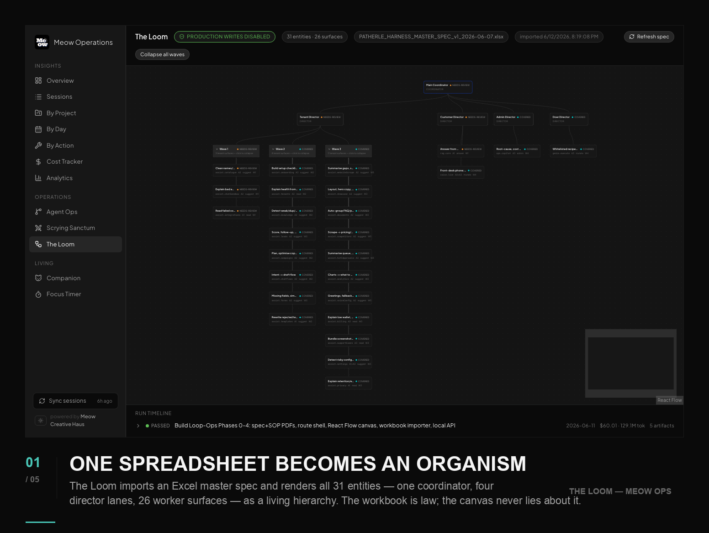</td>
    <td width="50%">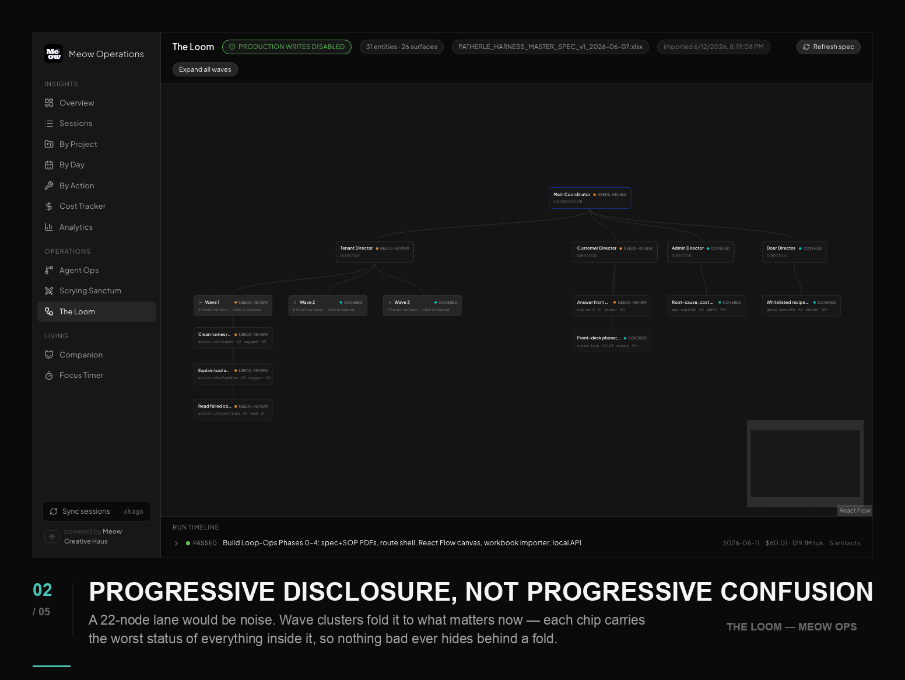</td>
  </tr>
  <tr>
    <td><strong>Hierarchy</strong><br>The loop at a glance, from coordinator to worker lanes.</td>
    <td><strong>Waves</strong><br>Expanded clusters when you need the denser shape of the system.</td>
  </tr>
  <tr>
    <td width="50%">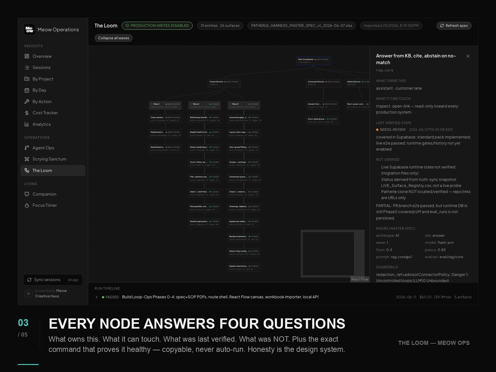</td>
    <td width="50%">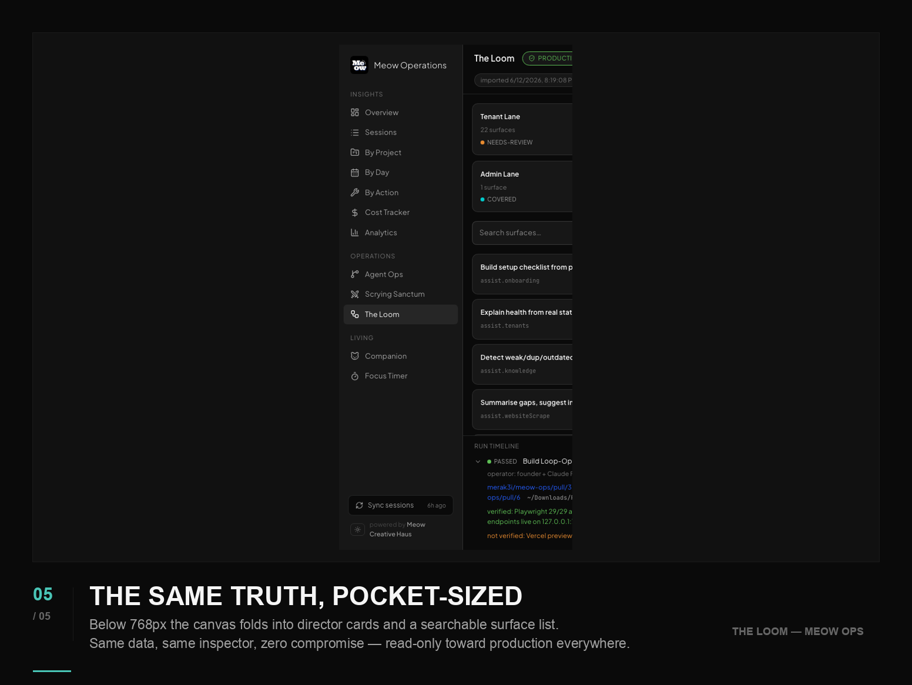</td>
  </tr>
  <tr>
    <td><strong>Inspector</strong><br>Ownership, access, verification, and what remains unverified.</td>
    <td><strong>Mobile fallback</strong><br>Lane cards and search when the canvas is too small.</td>
  </tr>
  <tr>
    <td colspan="2">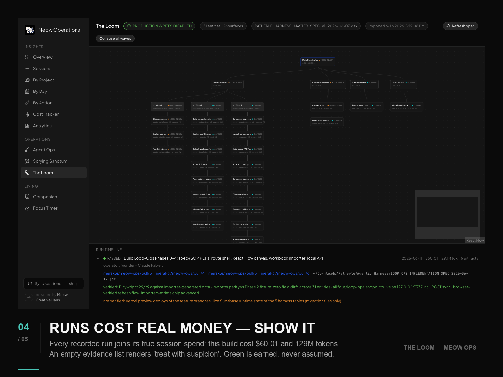</td>
  </tr>
  <tr>
    <td colspan="2"><strong>Timeline</strong><br>Recorded runs against current cost and evidence, so gaps stay visible.</td>
  </tr>
</table>

**What it shows:**
- Excel workbook importer with fail-loud validation. Unknown groups, duplicate keys, missing columns, or secret-shaped content stop the import with named violations.
- Collapsible wave clusters keep dense lanes readable. Minimap, keyboard access, light and dark theme, and reduced-motion support stay on.
- Every node answers four questions: what owns this, what it can touch, last verified state, and what was not verified.
- Inspector shows workflow-spec knobs, guardrails, eval gates, and copyable validation commands. The Loom never executes anything itself; execution is a separate Review Deck action that requires approval.
- Run timeline joins recorded loop runs against real session costs. An empty evidence list stays suspicious.
- Permanent "production writes disabled" badge. The alarm branch wears red, never the safe green.
- All loop data is local-only, and the hosted demo intentionally shows the instructional empty state.

Local API endpoints (`sync/local-api.mjs`): `GET /loop-ops/spec|status|runs`, `POST /loop-ops/sync` re-runs the importer. Import manually with `node sync/loop-ops-import.mjs`.

### Loop Engineering and Review Deck

Loop Engineering is the review loop around the agents: capture what happened, turn recurring friction into small proposals, let the owner decide, and measure the next run. It is designed to improve the workflow without letting automation approve itself.

The local pipeline can:

1. Capture loop runs and compare them against prior evidence.
2. Intake content-free summaries from Claude, Codex, Antigravity, and optional screenshots.
3. Mine recurring failures, wasted work, high-friction task types, and automation-health drift.
4. Generate deterministic proposals, optionally enrich drafts with a bounded local/DeepSeek model call, and produce a daily digest with history.
5. Route decisions through the Review Deck and explanations through the persistent Companion chat.
6. Execute only an approved, actionable proposal, with evidence recorded back to the local ledger.

Commands:

```bash
npm run loop:capture -- --loop <LOOP_ID> --since <ISO_TIME>
npm run intake
npm run digest
npm run daily
npm run loop:propose
npm run loop:review
npm run loop:simulate -- --proposal <PROPOSAL_ID>
node sync/local-api.mjs
npm run dev
```

`npm run loop:review` runs the local sync tests, evals, lint, typecheck, and build. It writes only check IDs and exit codes outside the worktree, then creates review-only Review Deck drafts for failures; raw terminal output is never stored. Include browser coverage when needed with `npm run loop:review -- --with-e2e`.

Open `http://localhost:5173/#/loop-review` for the owner surface. The optional executor runs an approved proposal in a temporary detached git worktree, applies the proposed diff, runs `npm ci`, `npm run test:sync`, `npm run eval`, and `npm run build`, then either records a dry-run or, in `push` mode, creates an `executor/<proposal-id>` branch and pull request. Only the hard-coded `test` and `prompt` categories may auto-merge after green PR checks; privacy, security, money, client-data, and production-infrastructure paths are forced to review-only.

Guarantees:

- Assistants can only create drafts. They cannot self-approve.
- Owner approvals happen through the local Review Deck or nonce-protected local API.
- Every ledger write goes through `appendRecord()`, field allowlists, validators, and redaction checks.
- The ledger lives outside the git worktree at `~/.meow-ops/loop-ledger/`.
- Real session data, secrets, local paths, and transcript content do not belong in tracked fixtures or PRs.
- Expired drafts are marked by `system:expire`, leave the active queue, and stay visible under the expired filter.

### Capacity & Usage

A local-first SuperAdmin cockpit for the operator's software stack: GitHub Actions run volume, cache and artifact footprint, SaaS subscription run rate, renewal pressure, and source wiring for private usage ledgers.

The public build ships a generic demo screen. Real account usage stays local in `public/data/superadmin-usage.json`, which is gitignored. Refresh it with:

```bash
npm run sync:superadmin
```

Optional environment:

```bash
MEOW_SUPERADMIN_GITHUB_REPOS=merak3i/meow-ops,<REPO_OWNER>/<REPO_NAME>
MEOW_SUPERADMIN_USAGE_SNAPSHOT=/absolute/path/to/superadmin-usage.json
MEOW_GITHUB_ACTIONS_MINUTES_LIMIT=3000
MEOW_GITHUB_ACTIONS_STORAGE_GB_LIMIT=10
```

The exporter accepts a local JSON snapshot shaped as `[{...}]`, `{ "services": [...] }`, `{ "rows": [...] }`, or `{ "saas": { "services": [...] } }`. Service-role keys and provider tokens do not belong in the snapshot.

### The Cat Companion

A living 3D companion rendered in WebGL with Kajiya-Kay fur shading, subsurface scattering, and proper procedural anatomy — that evolves based on your actual session data.

**Procedural companion rendering** (no glTF required, runs in-browser):
- React Three Fiber scene with breed-specific geometry, rooms, accessories, particles, and local-only gameplay state
- Pixel-cat sprite system for lightweight companion presentation and exportable cat cards
- XState emotional state machine driven by session profile, wellness, cursor movement, and focus state
- Post-processing bloom was intentionally removed after WebGL stability testing on Apple GPU paths

**Physical evolution — real mesh deformations:**

| Morph | Driver | Visual change |
|---|---|---|
| **Robustness** | Heavy `Bash` usage | More muscular frame |
| **Agility** | Heavy `Read` / `Grep` | Longer, leaner silhouette |
| **Intelligence** | Heavy `Agent` / `PlanMode` | Larger head |
| **Size** | Total tokens (lifetime XP) | kitten → elder |
| **Fatigue** | 4h overload window | Drooping posture |

**Tamagotchi gameplay** (lives in localStorage, nothing uploaded):
- 5 stats: Hunger, Energy, Happiness, Health, Shine — decay over real time
- Feed, play, groom, sleep — each triggers a particle effect on the 3D cat
- 20+ food items, 15+ accessories, 6 rooms (each changes HDRI lighting)
- Cat runs away after 14 days of neglect → memorial entry

**Personality traits** — the cat reflects your work pattern:

| 14-day dominant type | Trait | Bonus |
|---|---|---|
| Architect | 📐 Methodical | Happiness decay resistance |
| Builder | 🔨 Prolific | +10% shine from feed |
| Detective | 🔍 Vigilant | +5% health passive |
| Commander | ⚡ Bold | +10% energy from sleep |

**Memory markings** — permanent 3D marks earned once, never removed:
- 🩹 Scar — survived health < 5%
- ✨ Gold stripe — 7-day coding streak
- ⭐ Star mark — 100+ total sessions
- 🔥 Blaze — single session cost > $1
- 👑 Crown — 30-day streak

**Cat card export** — 📸 Share button → PNG download with name, breed, stats, trait badge, meow-ops watermark.

**Live session detection** — page polls every 30s. When new sessions are detected while you're working, the cat reacts with a gold sparkle burst.

### Companion AI Copilot

Companion is a persistent local-first chat dock available on every dashboard page. It keeps the last 30 messages in localStorage, restores the thread after reload, supports Enter-to-send / Shift+Enter-for-newline, and includes premade prompts for daily changes, sync health, next-fix ranking, and evidence-bound repair briefs.

Answers use deterministic local ledgers, digest data, and structured sync status first. DeepSeek is an optional, visibly labeled copilot only when local rules cannot answer the question; it does not execute changes. The local API keeps the existing weekly spend guard and per-process call cap. The daily operator forces `MEOW_LLM_CALLS_PER_CYCLE=1`, so its scheduled cycle can make at most one DeepSeek call and still produces a deterministic digest and nudge when AI is unavailable.

### macOS Menu Bar And Local Sync API

A native-feeling menu bar widget can request a background sync through the same observable runner used by the dashboard. Install the persistent helper and the single daily operator job with:

```bash
npm run agents:install
```

The installer renders paths for the current clone, keeps logs under `~/Library/Logs/meow-ops/`, removes the retired duplicate hourly jobs, keeps `com.meowops.localapi` alive, and runs `com.meowops.daily` once at 08:30 local time.

For a hosted dashboard that can trigger sync from the browser, run the local API on your machine:

```bash
node sync/local-api.mjs           # export local data (no git push — that is retired)
```

It listens on `http://localhost:7337`, serves fresh local `sessions.json` and `cost-summary.json`, and exposes asynchronous `POST /sync`, `GET /sync/status`, and `GET /sync/runs/:id`. A POST returns `202` with a run ID; the UI then follows `preflight → export sessions → verify artifacts → refresh limits`. Failures remain visible with a sanitized phase, code, and retry hint. Runtime metadata lives outside the worktree at `~/.meow-ops/runtime/`. This process reads only local files on your machine and never pushes to git. Requests are restricted to localhost; if you call it from a hosted dashboard URL, allowlist that origin with `MEOW_DASHBOARD_ORIGIN` (see `.env.example`).

### How Sessions Are Classified

Every session is auto-tagged by tool usage profile:

| Type | Trigger | Meaning |
|---|---|---|
| 🏗️ Builder | >40% Write + Edit | Heavy coding/writing |
| 🔍 Detective | >50% Read + Grep + Glob | Code exploration |
| 💻 Commander | >40% Bash | Shell/system work |
| 📐 Architect | >20% Agent + PlanMode | Planning/orchestration |
| 🛡️ Guardian | Top tool is Grep/Read | Audits and reviews |
| 📝 Storyteller | Top tool is Write | Docs and content |
| 👻 Ghost | <3 messages or no tools | Empty session |

### Supported Models

30+ models with accurate pricing:

| Family | Models |
|---|---|
| **Claude** | Opus 4, Sonnet 4.6, Sonnet 4.5, Haiku 4.5 |
| **OpenAI** | GPT-4o, GPT-4o-mini, GPT-5, o3, o4-mini |
| **DeepSeek** | V3, R1, R1-0528 |
| **Qwen** | Max, Plus, Turbo (Alibaba DashScope) |
| **Moonshot** | Kimi K2 |
| **Zhipu** | GLM-4, GLM-4-Flash (free) |
| **ByteDance** | Doubao-Pro |
| **xAI** | Grok-3, Grok-3-mini, Grok-2 |
| **Cohere** | Command R+, Command R |
| **Amazon** | Nova Pro, Nova Lite, Nova Micro |
| **Google** | Gemini 3 Pro, 3 Flash, 2.5 Pro, 2.5 Flash, 2.0 Flash, 1.5 Pro, 1.5 Flash |
| **Mistral** | Large, Small |
| **Perplexity** | Sonar Pro, Sonar |
| **Local** | Llama 3.3-70B (cost = $0) |

Unknown variants match by family fuzzy search.

---

## Sync Pipeline

`sync/export-local.mjs` is the source of truth for generated dashboard data.

It currently:
- Reads Claude Code JSONL files from `~/.claude/projects/`
- Reads Codex Desktop rollouts from `~/.codex/sessions/`
- Reads Google Antigravity transcripts from `~/.gemini/antigravity/` (time/tools/project only; usage not exposed by Antigravity)
- Optionally reads Cursor logs from `CURSOR_LOGS_DIR`
- Optionally reads Aider project histories from `AIDER_PROJECTS`
- Deduplicates and classifies sessions, refines project names from `cwd`, calculates model cost, and sorts by latest activity
- Writes `public/data/sessions.json`
- Writes `public/data/cost-summary.json` for all-session daily and spend buckets
- Strips `cwd`, chat titles, and first-user-message snippets from the exported sessions payload
- Keeps `sync/upload-to-supabase.mjs` and `sync/full-sync.mjs` as optional advanced workflows, not the default analytics path

The default invocation writes local files only. The former `--push` path is retired; passing it prints a warning and never commits or uploads session data.

Useful commands:

```bash
node sync/export-local.mjs
node sync/fetch-claude-limits.mjs
```

---

## Hosted shell (still local-only for session data)

This is optional. The default Meow Ops setup is local-only.

> **Privacy change:** hosted builds no longer rely on `VITE_SESSIONS_URL` or a public `sessions.json`. Older public-bucket setups exposed session metadata more broadly than intended, so the default path is now localhost helper first, demo fallback second.

### 1. Install one daily local cycle

```bash
npm run agents:install
```

At 08:30 local time, `sync/daily-operator.mjs` runs one bounded flow:

1. Export and verify local session artifacts.
2. Refresh usage limits as an optional, timeout-bounded phase.
3. Run intake, automation health, deterministic proposal rules, and the digest.
4. Allow at most one DeepSeek enrichment call.
5. Write a local Companion nudge under `~/.meow-ops/runtime/`.

### 2. Keep repository review running while the laptop is off

`.github/workflows/daily-operator.yml` runs at `03:00 UTC` (`08:30 IST`) and can also be started with **Run workflow**. It executes the cloud-safe review gates, writes the result to the GitHub Actions job summary, and uploads a 30-day `meow-ops-daily-<run-id>` artifact containing only check IDs, exit codes, commit metadata, and a deterministic nudge.

The GitHub-hosted runner cannot read `~/.claude`, `~/.codex`, the local ledger, LaunchAgents, or `127.0.0.1:7337`. Its report therefore marks local session sync as `deferred`; the macOS daily operator catches up private session data the next time the laptop is online. This split keeps the repository monitored every day without uploading personal session data.

Run the same cloud-safe review locally with:

```bash
npm run daily:cloud
```

### 3. Optional: keep the localhost helper running

If you want the hosted `vercel.app` shell to read local data from the same machine, keep the helper alive with launchd:

`npm run agents:install` installs this service together with the daily job. To run only in the current terminal, use `node sync/local-api.mjs`.

The hosted shell will try `127.0.0.1:7337` first. If the helper is not running, it falls back to bundled demo data instead of pulling a public session feed.

### 4. Optional: deploy the static shell to Vercel

```bash
npx vercel --prod
```

That deploy publishes the UI shell only. Session analytics remain local unless you intentionally rewire the app to use a remote store.

### 5. Install to dock

1. Open your Vercel URL in Chrome
2. Address bar → install icon (⊕)
3. Right-click dock icon → Options → Keep in Dock

### 6. Scrying Sanctum (Supabase Realtime, optional)

Run the migration to enable live agent pipeline visualization:

```bash
# In Supabase SQL editor:
-- Run db/migrations/0003_scrying_sanctum.sql
```

This creates `ss_pipelines`, `ss_nodes`, `ss_edges`, `ss_runestones` with multi-tenant RLS and enables Realtime publication. Without this, the Scrying Sanctum page runs in demo mode automatically.

---

## Architecture

```
Local machine                                         Hosted shell (optional)
─────────────                                         ───────────────────────
~/.claude/projects/         ~/.codex/sessions/
  ├── <session>.jsonl          └── <session>.jsonl
  └── subagents/
       └── agent-*.jsonl
              │
              ▼
      sync/export-local.mjs
      (parse · dedupe · classify · cost-calculate)
              │
              ├──── public/data/sessions.json
              │          │
              │          ├──── localhost:5173 / preview
              │          └──── sync/local-api.mjs ──► hosted shell on same machine
              │
              └──── daily operator: sync → verify → review → nudge

PWA on dock ──► vercel.app ──── local helper first, demo fallback
              React 19 + Vite 8 + Recharts + D3 + AG Grid
              Three.js companion + Sanctum scene (WebGL)
              XState emotional state machine
              Supabase Realtime (Scrying Sanctum)
```

**No hosted backend. No server-side rendering.** The default setup is a static bundle plus local JSON exports. Supabase Realtime is opt-in for the Scrying Sanctum pipeline visualizer only. `sync/upload-to-supabase.mjs` remains available for intentionally operator-managed storage, but it is not part of the default session analytics path.

---

## Tech Stack

| Layer | Tech |
|---|---|
| Frontend | React 19 + Vite 8 |
| 3D Companion | Three.js + React Three Fiber + custom GLSL shaders |
| State machine | XState 5 (companion emotional states) |
| Charts | Recharts |
| Pipeline visualizer | D3 (zoom/pan/SVG) |
| Styling | Tailwind CSS 4 + OKLCH design tokens |
| Data grid | AG-Grid (session analytics table) |
| Storage | Local JSON exports by default |
| Realtime | Supabase Realtime (Scrying Sanctum, opt-in) |
| Hosting | Vercel (or any static host) |
| Sync | Node.js ESM scripts |
| Local helper | localhost sync API on port `7337` |

---

## Testing

End-to-end tests run against the production build using Playwright:

```bash
npm run build         # build dist/
npx playwright test   # runs the Playwright suite against npm run preview
```

Tests cover the dashboard and operations surfaces, key interactions, PWA manifest, and data endpoints. The `playwright.config.ts` uses a single Chromium project against `http://localhost:4173` (Vite preview port). The sync suite covers parsers, local API boundaries, intake redaction, loop ledger transitions, proposals, digests, execution gates, and SuperAdmin snapshots.
`npm run eval` is the blocking privacy + loop-integrity gate.

To run a single test file or test by name:

```bash
npx playwright test --grep "Scrying Sanctum"
npx playwright test --reporter=list
```

---

## Privacy

- **Local-only by default.** Session analytics are loaded from local files or the localhost helper, not from a public cloud feed.
- **Why this changed.** Public `sessions.json` links were too easy to expose accidentally, so the hosted shell now avoids public session feeds by default.
- **Public deploys fall back to demo data.** If the localhost helper is unavailable, the hosted shell shows bundled demo data instead of your private sessions.
- **Sessions JSON contains metrics only** — token counts, tool counts, durations, model names, and project labels. No message content, no prompts, no first-user-message snippets, no chat titles, no code, and no absolute `cwd` paths.
- **Supabase is optional and scoped.** The default app no longer depends on Supabase Storage for session analytics. Supabase Realtime remains opt-in for Scrying Sanctum.
- **Service key is local-only.** It never appears in the production bundle.
- **Hosted demo password gate is optional.** `VITE_ACCESS_PASSWORD` only protects demo access; it is not an account system.
- **Optional model enrichment is bounded.** Transcript/screenshot intake uses a localhost-only LM Studio endpoint when configured. Companion can use DeepSeek only when explicitly configured, with per-process and weekly spend caps; deterministic answers remain available without it.
- **No analytics, no telemetry, no tracking.** The app has no idea you exist.

---

## Roadmap

### Token Value Index _(designed, not yet built)_

Link sessions to git commits and measure what shipped:
- Lines of code merged per $1 spent
- Successful sessions (committed output) vs. ghost sessions (nothing landed)
- Project ROI: which codebases generate the most value per token
- Model comparison: which model gets you to commit fastest

### Gemini CLI + OpenRouter parsers _(planned)_

Parsers for additional AI tools:
- `sync/parse-gemini.mjs` — Gemini CLI session logs
- `sync/parse-openrouter.mjs` — unified cost across all OpenRouter models
- `sync/parse-ollama.mjs` — local model sessions (cost = electricity estimate)

### Scrying Sanctum enhancements _(planned)_

- Supabase integration guide for connecting your own multi-agent pipelines
- WebSocket bridge for non-Supabase backends
- Node clustering for large pipelines (10+ agents)
- Replay mode: scrub through a completed pipeline run

### Community Cat Registry _(planned)_

Opt-in. Share your companion's current state (not your session data) to a public registry. See how your cat's physique compares to other developers globally. Leaderboards by growth stage, rarity tier, streak length.

Privacy-first and opt-in by design.

---

## Contributing

Every feature on the roadmap is an open issue. The highest-impact contributions:

**New model parsers**
- `sync/parse-gemini.mjs` — Gemini CLI
- `sync/parse-openrouter.mjs` — OpenRouter unified

**Analytics**
- Token value index (link sessions to git commits)
- Session quality score (output tokens / ghost ratio / tool diversity)
- Model comparison view (same project, different models, side-by-side cost)

**Companion**
- New cat types / classifier rules for new tools
- Sound design (purring on focus, chirps on breakthroughs)
- Cat card frame designs (community-submitted overlays)

**Agent Visualizer / Scrying Sanctum**
- Live replay mode (replay a session's agent operations at 10× speed)
- Cross-run comparison (trend lines: are your runs getting cheaper?)
- Scrying Sanctum zoom/pan canvas (true spatial layout, not horizontal scroll)

PRs welcome. Open an issue first for anything substantial.

---

## Project Structure

```
meow-ops/
├── public/
│   ├── manifest.json            PWA manifest
│   ├── sw.js                    Service worker (network-first)
│   └── data/                    Generated by export-local.mjs
│       ├── sessions.json        All parsed sessions (last 1000)
│       └── cost-summary.json    Today/week/month/year spend buckets
├── db/
│   └── migrations/
│       ├── 0001_initial_schema.sql    Core sessions schema
│       ├── 0002_daily_summaries.sql   Daily aggregates table
│       ├── 0003_scrying_sanctum.sql   Pipeline viz schema + RLS + Realtime
│       └── 0004_rls_tenant_isolation.sql  Strict per-tenant SELECT (no NULL-tenant world read)
├── e2e/
│   └── meow-ops.spec.ts         Playwright e2e tests
├── src/
│   ├── analytics/               Velocity, efficiency, burn-rate, profile modules
│   ├── companion-v2/            WebGL/pixel companion
│   │   ├── CompanionScene.tsx   R3F canvas, HDRI rooms, particles, post-processing
│   │   ├── CompanionPageV2.tsx  Orchestrator — polling, milestones, marks
│   │   ├── StatsPanel.tsx       Stat bars, actions, trait badge, share button
│   │   ├── useCompanionGame.ts  Store wrapper, personality trait, memory marks
│   │   ├── PixelCat.tsx         Lightweight breed sprite renderer
│   │   ├── ParticleOverlay.tsx  Per-action particle effects
│   │   ├── MilestoneOverlay.tsx Celebration overlay (growth, streaks, spend)
│   │   └── CatCardExport.tsx   Canvas2D overlay → PNG download
│   ├── components/              Charts, session table, nav, password gate, date filter
│   ├── lib/
│   │   ├── agent-tree.ts        Forest builder, efficiency index, cache hit rate
│   │   └── companion-store.js   Tamagotchi engine (localStorage)
│   ├── pages/
│   │   ├── AgentVisualizer.tsx  Gantt timeline, ghost flagging, drill-down
│   │   ├── AgentDetailPanel.tsx Slide-in session detail panel
│   │   ├── ScryingSanctum.tsx   3D agent pipeline visualizer
│   │   ├── LoopOps.tsx           The Loom loop topology and evidence view
│   │   ├── LoopReview.tsx        Owner Review Deck, digest, Ask, and execution controls
│   │   ├── CapacityUsage.jsx     Local-first SuperAdmin usage cockpit
│   │   └── ...                  Overview, Sessions, ByDay, ByProject, etc.
│   ├── scrying-sanctum/         Realtime pipeline components for external feeds
│   │   ├── ScryingSanctum.tsx   Main page — D3 zoom canvas, legend, loot box
│   │   ├── ChampionNode.tsx     SVG foreignObject node card
│   │   ├── LeyLine.tsx          SVG path with flow animation + runestones
│   │   ├── Runestone.tsx        Animated token packet (RAF path-following)
│   │   ├── championsConfig.ts   Node metadata, colors, Bezier path builder
│   │   ├── useScryingData.ts    Supabase/demo data hook with Realtime subscriptions
│   │   ├── types.ts             SsNode, SsEdge, SsRunestone, SsPipeline types
│   │   └── scrying-sanctum.css  Ley line animations, champion cards, loot box
│   ├── state/
│   │   └── companionMachine.ts  XState machine — emotional states, cursor tracking
│   └── types/
│       └── session.ts           Single source of truth for all session types
├── sync/
│   ├── parse-session.mjs        JSONL parser with agent hierarchy extraction
│   ├── parse-codex.mjs          OpenAI Codex Desktop parser
│   ├── parse-cursor.mjs         Cursor IDE log parser
│   ├── parse-aider.mjs          Aider chat history parser
│   ├── parse-antigravity.mjs    Google Antigravity transcript parser (time/tools; usage not exposed)
│   ├── session-utils.mjs        Shared snippet/project/default-session helpers
│   ├── cost-calculator.mjs      30+ model pricing with fuzzy matching
│   ├── export-local.mjs         All sources → sessions.json + cost-summary.json
│   ├── sync-runner.mjs          Single-flight observable sync state machine
│   ├── fetch-claude-limits.mjs  Refresh local rate-limits.json from explicit env values
│   ├── upload-to-supabase.mjs   Optional advanced Storage upload script
│   ├── full-sync.mjs            export + upload in one shot
│   ├── local-api.mjs            localhost sync, loop, intake, and execution API
│   ├── intake-*.mjs              Local transcript, log, and screenshot intake
│   ├── loop-capture.mjs          Capture runs and session evidence
│   ├── loop-propose.mjs          Deterministic proposal generation and miners
│   ├── loop-simulate.mjs         Proposal simulation
│   ├── loop-execute.mjs          Gated worktree execution and optional PR creation
│   ├── loop-digest.mjs           Daily digest and digest history
│   ├── daily-operator.mjs         One daily sync, review, AI-cap, and nudge cycle
│   ├── cloud-daily-review.mjs      GitHub-safe repository review and artifact report
│   ├── install-macos-agents.mjs   Render and activate current-path LaunchAgents
│   ├── loop-ledger.mjs           Redacted append-only local ledger
│   ├── com.meowops.localapi.plist Persistent localhost-helper template
│   └── com.meowops.daily-digest.plist Single daily operator template
├── menubar/
│   ├── MeowOpsBar.swift         macOS menu bar companion source
│   └── build.sh                 Build script for MeowOpsBar.app
├── playwright.config.ts         Playwright configuration
├── .github/workflows/
│   ├── ci.yml                    Push and pull-request verification
│   └── daily-operator.yml        03:00 UTC repository review schedule
└── .env.example
```

---

## License

MIT. Build with it, fork it, ship it. Keeping derivative tools open source is encouraged, but not required by the license.

---

## Credits

3D fur rendering inspired by Kajiya-Kay shading models. Focus timer mechanics inspired by [Forest: Stay Focused](https://www.forestapp.cc). Visual design language inspired by [ElevenLabs](https://elevenlabs.io). Built with [Claude Code](https://claude.com/claude-code).

---

*Meow Operations is a community tool. It has no business model, no venture funding, and no plans to acquire either. It exists because developers deserve to understand their AI spend — and because the interface for that understanding should feel like something you want to open.*
