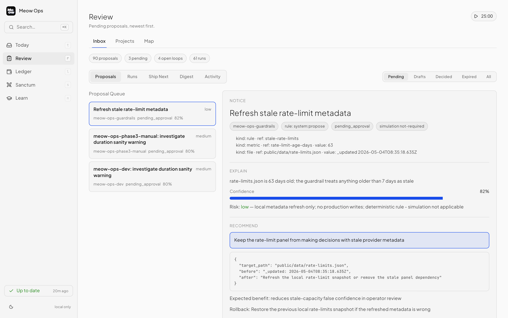
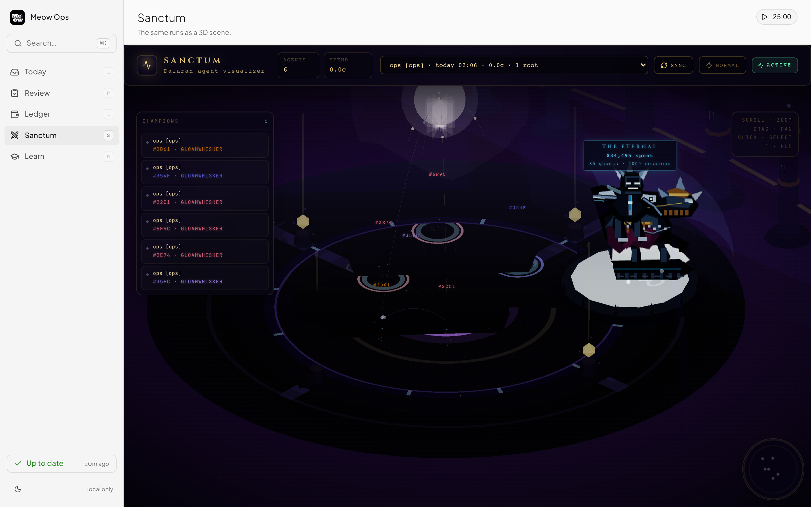
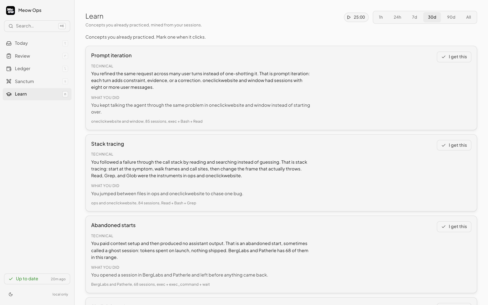
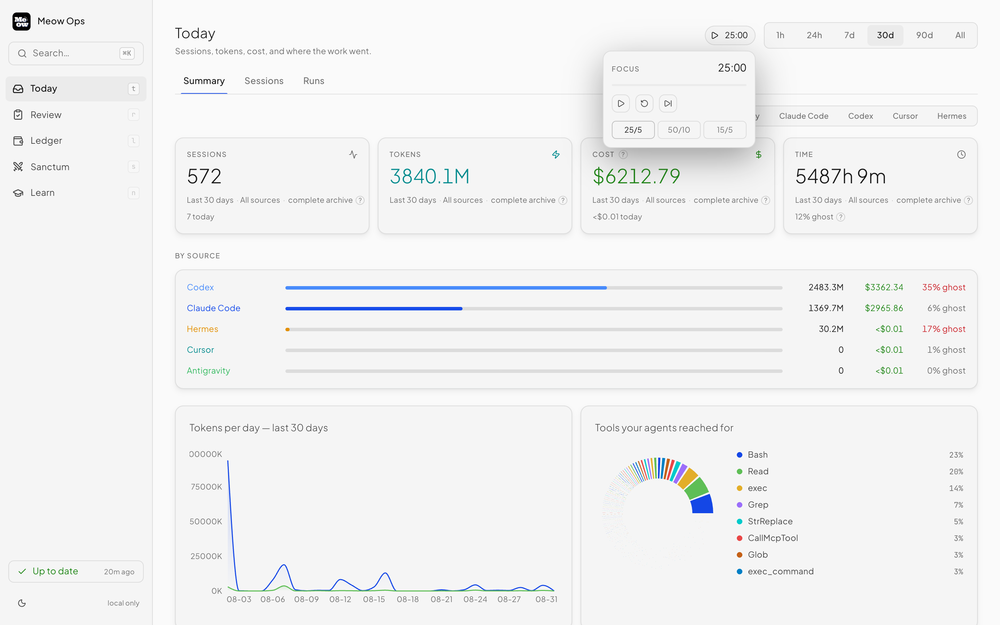

# 🐾 Meow Operations

> **Meow Ops is the local inbox for AI coding work. It shows what happened, what it cost, and what you should decide next.**

Meow Operations turns local Claude Code, OpenAI Codex Desktop, Aider, Cursor, Hermes, and Google Antigravity activity into an installable PWA. Five surfaces: Today, Review, Ledger, Sanctum, Learn. The focus timer sits on every screen as a chip. Companion is gone. Nothing applies until you say so. No required account. No telemetry. MIT-licensed.

## What's new in 1.2.0

The sidebar is five words: Today, Review, Ledger, Sanctum, Learn. The focus timer is a chip on every screen. Companion is removed.

Learn mines concepts from sessions you already ran. Each card has a name, a short industry technical summary, a layman "what you did" line, a source, and an I get this mark. You search YouTube yourself. No school, no XP.

Today answers what happened. Review holds proposals until you approve them. Ledger holds spend. Sanctum and Learn are the two rooms that stayed.

## Screenshots

<table>
  <tr>
    <td width="50%"></td>
    <td width="50%"></td>
  </tr>
  <tr>
    <td><strong>Today</strong><br>Sessions, tokens, cost, and where the work went. The focus timer opens from a chip on this screen.</td>
    <td><strong>Review</strong><br>Pending proposals. Nothing applies until you say so.</td>
  </tr>
  <tr>
    <td width="50%"></td>
    <td width="50%"></td>
  </tr>
  <tr>
    <td><strong>Ledger</strong><br>Spend, tokens, and unattributed provider usage.</td>
    <td><strong>Sanctum</strong><br>The same runs as a 3D scene.</td>
  </tr>
  <tr>
    <td width="50%"></td>
    <td width="50%"></td>
  </tr>
  <tr>
    <td><strong>Learn</strong><br>Concepts mined from your sessions. Name, technical summary, what you did, source, I get this.</td>
    <td><strong>Focus timer</strong><br>A chip on every screen. Not a page.</td>
  </tr>
</table>

---

## Install — 2 minutes, zero accounts

### Prerequisites
- **Node.js 18+** — check with `node --version`
- **npm** (comes with Node) or pnpm
- **Claude Code** installed and used at least once (your sessions live in `~/.claude/projects/`)

### Download and run

```bash
git clone https://github.com/merak3i/meow-ops.git
cd meow-ops
npm install
node sync/export-local.mjs    # parses ~/.claude/projects → public/data/sessions.json
npm run dev                   # opens http://localhost:5173
```

That's it. Your real session data loads on first page hit.

### First-time setup

1. Open `http://localhost:5173` in Chrome
2. The dashboard loads your parsed local sessions immediately
3. Codex Desktop sessions are read from `~/.codex/sessions/` automatically when present
4. To add Aider sessions: `AIDER_PROJECTS=/path/to/your/project node sync/export-local.mjs`
5. Cursor agent transcripts are read from `~/.cursor/projects` when present. Optional Enterprise usage enrichment: set `CURSOR_ADMIN_API_KEY` (never commit it)
6. Re-run the sync command any time after new AI sessions to refresh

Every parsed session is preserved in an uncapped, append-only local archive. The
generated `sessions.json` file is only a bounded browser compatibility preview;
it defaults to the latest 1,000 sessions so older browsers and static tooling
stay responsive. Change the preview size with:

```bash
MEOW_SESSION_PREVIEW_LIMIT=2000 node sync/export-local.mjs
```

All-time totals and date-range queries use the complete archive and its
summaries, not the compatibility preview. `MEOW_MAX_SESSIONS` remains accepted
as a legacy alias for the preview limit; it is not a retention setting.

### Install as a PWA (dock-installable)

Run locally, then in Chrome: **address bar → install icon (⊕)** → the dashboard installs to your dock or desktop. Works offline via service worker.

For a hosted shell that still reads local data from the same machine, see the **Hosted shell (still local-only for session data)** section below.

---

## The Problem Nobody Talks About

Developers using AI tools — Claude, GPT-4o, Gemini, Codex, Cursor, Aider — spend hundreds of dollars a month on tokens with almost no visibility into what they got for it. Not cost-per-model. Not which project burns the most. Not whether a session actually shipped something or just spun its wheels.

As workflows get more layered, it also gets harder to see what is verified, what is assumed, and what still needs review.

The tools that do exist count tokens. None of them:
- Tell you what those tokens **produced**
- Work across **multiple AI models** in one view
- Let you watch your **agents operate in real time**
- Make any of it **fun to look at**

Meow Operations fixes all four. For free. For everyone.

---

## What It Does

### Analytics Dashboard
Tracks sessions from **Claude Code**, **OpenAI Codex Desktop**, **Aider**, **Cursor**, and **Google Antigravity** in one unified view. Cost tables for 30+ models.

> **Google Antigravity note:** Antigravity stores session **time, tools, and project** locally (parsed from `~/.gemini/antigravity/brain/<id>/.system_generated/logs/transcript.jsonl`), but it does **not** expose **token counts, the model used, or cost** on disk — the conversation store is encrypted and usage lives server-side. Antigravity sessions are therefore tracked for time/tools/project and shown with `usage_available: false`; tokens and cost are never fabricated or estimated for them.

> **Cursor note:** Local agent transcripts under `~/.cursor/projects/*/agent-transcripts/` expose messages, tools, and parent/subagent hierarchy. They do not expose authoritative model, token, or cost values. meow-ops never infers a historical model from the currently selected Cursor model, and never treats a nested Task argument such as `model="fast"` as the parent model. Optional official enrichment uses `POST /teams/filtered-usage-events` when a team administrator sets `CURSOR_ADMIN_API_KEY`. Cursor's published response schema currently documents model, token, and cost fields but not a conversation or cloud-agent identifier. If the API explicitly returns a known conversation/cloud-agent id variant, it joins only on exact equality with a local id. Otherwise, usage stays in `cost-summary.json` as aggregate Cursor usage and is never assigned to a session. The credential is never logged, exported, or written to disk. Without a key, the local parser still works.

Safe activation is owner-operated: open the Cursor dashboard, go to **Settings → Cursor Admin API Keys**, and stop if your account does not expose that team-admin surface. Create/copy the key yourself, then place `CURSOR_ADMIN_API_KEY=<YOUR_KEY>` in this repository's gitignored `.env` using a local text editor. Never paste the key into chat, Terminal history, issues, commits, screenshots, or generated data. Re-run `node sync/export-local.mjs`; verify only the non-secret `cursorUsage.status`, `matched_sessions`, and `unmatched` fields in `public/data/cost-summary.json`. Ledger displays unmatched totals separately and never attributes them to a local session.

| Surface | What you see |
|---|---|
| **Today** | Sessions, tokens, cost, and where the work went. Tabs: Summary, Sessions, Runs. |
| **Review** | Pending proposals and project evidence. Nothing applies until you say so. Tabs: Inbox, Projects, Map. |
| **Ledger** | Spend, tokens, and unattributed provider usage. |
| **Sanctum** | The same runs as a 3D scene. |
| **Learn** | Concepts you already practiced, mined from your sessions. Name, technical summary, what you did, source, I get this. |

The focus timer is a chip on every screen, not a page. Companion is removed from the product.

### Learn

Learn is a concept map inferred from real sessions. Each card has a name, a short industry technical summary, a layman "what you did", a source, and an I get this mark. No YouTube finder, no school, no XP, no workshop.

### Source Breakdown

When more than one source has data, **Today** shows a source split:

- Sessions, tokens, and cost per source
- Ghost rate per source
- Filter the view to one source from the page

Ledger is the place for unmatched provider usage that cannot be joined to a local session.

### Codex Desktop Parser

Codex Desktop support is first-class, not a CSV import. `sync/parse-codex.mjs` walks:

```text
~/.codex/sessions/YYYY/MM/DD/rollout-<timestamp>-<uuid>.jsonl
```

It extracts rollout ID, project path, model family, token totals, tool calls, first user-message snippet, session title from `session_index.jsonl` when available, and estimated model cost. Malformed historical rows are skipped instead of blocking the export.

### Agent Operations Visualizer

When Claude Code runs with subagents, meow-ops turns the session tree into a Gantt timeline showing exactly what ran in parallel vs. sequentially:

```
Run: storefront-redesign — 3 agents — $0.84 — 12m ago
⏱ 10:32:14 ───────────────────────────── 10:34:57 IST
├── 📐 Sonnet  code-explorer    ████████████           47s $0.12
├── 📐 Sonnet  code-architect      ███████████████████ 1m42s $0.51
└── 🔍 Haiku   code-reviewer    ████████               38s $0.09

⚡ 14,200 tok/$  (efficiency index)
```

Click any row for a full breakdown: token split, cache hit rate, tool usage, sidechain flag.

### Sanctum

A 3D Dalaran-style multi-agent pipeline visualizer for local session data. Watch agent runs, token flow, latency, and session health traverse the network as animated runestones along glowing ley lines.

```
Argent Vanguard ──────────── Ebon Blade Scout ──────────── Dalaran Archmage ──── Argent Herald
  [active]       healthy ley     [active]       choked ley     [active]            [idle]
  $0.0009                        $0.0041                        $0.0223             $0.0003
  112ms                          1480ms                         3240ms              58ms
```

**Features:**
- Four champion node types with distinct sigils and accent colors
- Ley line health states: `healthy` (fast flow), `choked` (slow flow), `severed` (flickering)
- Animated runestones travel along ley line paths carrying JSON/text/error payloads
- Click any runestone to open a Loot Box modal showing full payload, token count, and latency
- WebGL plaza scene with performance guardrails, minimap, Lich King custodian, and LLM Sun token emitter
- Demo mode and local-session mode with no Supabase account required
- Supabase Realtime schema remains available for external pipelines in `db/migrations/0003_scrying_sanctum.sql`

See `db/migrations/0003_scrying_sanctum.sql` for the full schema and RLS policies.

### Review Map

Review Map is the read-only topology and evidence view for loop-based workflows. It imports a workbook or workflow spec, builds the hierarchy on top of it, and renders the result as an interactive React Flow canvas. Review Inbox is the owner-governed change surface.

Use it when a loop matters more than a single run:
- Check the shape of the loop before execution starts.
- Open any node to see ownership, access, last verified state, and what remains unverified.
- Keep review and refresh local while the source spec changes.
- Compare recorded runs with current cost and evidence.
- Keep unverified items clearly labeled until evidence appears.

```
                       Main Coordinator
        ┌──────────┬──────┴───────┬─────────────┐
 Research Dir   Build Dir     Review Dir      Ops Dir
   ┌──┬──┐       ┌──┬──┐        ┌──┬──┐        ┌──┐
  W1 W2 …       W3 W4 …        W5 W6 …        W7 …
 [review]      [covered]      [passed]       [blocked]
```

Review Map lives under Review · Map. It is the same inbox as a graph.

**What it shows:**
- Excel workbook importer with fail-loud validation. Unknown groups, duplicate keys, missing columns, or secret-shaped content stop the import with named violations.
- Collapsible wave clusters keep dense lanes readable. Minimap, keyboard access, light and dark theme, and reduced-motion support stay on.
- Every node answers four questions: what owns this, what it can touch, last verified state, and what was not verified.
- Inspector shows workflow-spec knobs, guardrails, eval gates, and copyable validation commands. Review Map never executes anything itself; execution is a separate Review Inbox action that requires approval.
- Run timeline joins recorded loop runs against real session costs. An empty evidence list stays suspicious.
- Permanent "production writes disabled" badge. The alarm branch wears red, never the safe green.
- All loop data is local-only, and the hosted demo intentionally shows the instructional empty state.

Local API endpoints (`sync/local-api.mjs`): `GET /loop-ops/spec|status|runs`, `POST /loop-ops/sync` re-runs the importer. Import manually with `node sync/loop-ops-import.mjs`.

### Review Inbox

Loop Engineering is the review loop around the agents: capture what happened, turn recurring friction into small proposals, let the owner decide, and measure the next run. It is designed to improve the workflow without letting automation approve itself.

The local pipeline can:

1. Capture loop runs and compare them against prior evidence.
2. Intake content-free summaries from Claude, Codex, Antigravity, and optional screenshots.
3. Mine recurring failures, wasted work, high-friction task types, and automation-health drift.
4. Generate deterministic proposals, optionally enrich drafts with a bounded local/DeepSeek model call, and produce a daily digest with history.
5. Route decisions through Review Inbox. Nothing applies until you say so.
6. Execute only an approved, actionable proposal, with evidence recorded back to the local ledger.

Commands:

```bash
npm run loop:capture -- --loop <LOOP_ID> --since <ISO_TIME>
npm run intake
npm run digest
npm run daily
npm run loop:propose
npm run loop:review
npm run loop:simulate -- --proposal <PROPOSAL_ID>
node sync/local-api.mjs
npm run dev
```

`npm run loop:review` runs the local sync tests, evals, lint, typecheck, and build. It writes only check IDs and exit codes outside the worktree, then creates review-only Inbox drafts for failures; raw terminal output is never stored. Include browser coverage when needed with `npm run loop:review -- --with-e2e`.

Open `http://localhost:5173/#/review/inbox` for the owner surface. The optional executor runs an approved proposal in a temporary detached git worktree, applies the proposed diff, runs `npm ci`, `npm run test:sync`, `npm run eval`, and `npm run build`, then either records a dry-run or, in `push` mode, creates an `executor/<proposal-id>` branch and pull request. Only the hard-coded `test` and `prompt` categories may auto-merge after green PR checks; privacy, security, money, client-data, and production-infrastructure paths are forced to review-only.

Guarantees:

- Assistants can only create drafts. They cannot self-approve.
- Owner approvals happen through Review Inbox or the nonce-protected local API.
- Every ledger write goes through `appendRecord()`, field allowlists, validators, and redaction checks.
- The ledger lives outside the git worktree at `~/.meow-ops/loop-ledger/`.
- Real session data, secrets, local paths, and transcript content do not belong in tracked fixtures or PRs.
- Expired drafts are marked by `system:expire`, leave the active queue, and stay visible under the expired filter.

#### Live truth from Supabase (optional)

The Excel workbook is the **structure** (which surfaces exist). The live **truth states** (which gate passed, the db status, last-verified time) come from a Supabase table — e.g. one an upstream system keeps current. They join through the importer's existing truth CSV, so nothing in the importer changes:

```
Supabase table  →  sync/loop-ops-supabase.mjs  →  truth.csv  →  loop-ops-import.mjs --truth  →  spec.json  →  Review Map
(live state)        (this connector, opt-in)       (local)        (joins Excel + truth)            (local)       (renders)
```

The connector is **opt-in and a no-op until configured** (set `LOOP_OPS_SUPABASE_URL/_KEY/_TABLE` in `.env`; remap differing column names with `LOOP_OPS_SUPABASE_COLMAP`). Each row is keyed by `surface_key` — the same key the workbook uses. Only the cloud pull needs network; the importer, `spec.json`, and Review Map stay fully local/offline.

**Three ways to keep it synced:**

| Cadence | How | Freshness |
|---|---|---|
| **Manual** | `node sync/loop-ops-supabase.mjs && node sync/loop-ops-import.mjs --truth public/data/loop-ops/truth.csv` (or Review Map **Refresh** after a pull) | on demand |
| **Near-real-time (pull)** | run that pair on a `launchd` / GitHub Actions cron every N minutes | minutes |
| **Real-time (push)** | `node sync/loop-ops-supabase-watch.mjs` — subscribes to Supabase **Realtime** (`postgres_changes`) and regenerates on every table change | seconds |

The real-time watcher needs Realtime enabled on the table: `ALTER PUBLICATION supabase_realtime ADD TABLE <your_table>;`.

### Seats (hidden)

A local-first SuperAdmin cockpit for the operator's software stack: GitHub Actions run volume, cache and artifact footprint, SaaS subscription run rate, renewal pressure, and source wiring for private usage ledgers. Reachable from the command palette, not the sidebar.

The public build ships a generic demo screen. Real account usage stays local in `public/data/superadmin-usage.json`, which is gitignored. Refresh it with:

```bash
npm run sync:superadmin
```

Optional environment:

```bash
MEOW_SUPERADMIN_GITHUB_REPOS=merak3i/meow-ops,<REPO_OWNER>/<REPO_NAME>
MEOW_SUPERADMIN_USAGE_SNAPSHOT=/absolute/path/to/superadmin-usage.json
MEOW_GITHUB_ACTIONS_MINUTES_LIMIT=3000
MEOW_GITHUB_ACTIONS_STORAGE_GB_LIMIT=10
```

The exporter accepts a local JSON snapshot shaped as `[{...}]`, `{ "services": [...] }`, `{ "rows": [...] }`, or `{ "saas": { "services": [...] } }`. Service-role keys and provider tokens do not belong in the snapshot.

### macOS Menu Bar And Local Sync API

A native-feeling menu bar widget can request a background sync through the same observable runner used by the dashboard. Install the persistent helper and the single daily operator job with:

```bash
npm run agents:install
```

The installer renders paths for the current clone, keeps logs under `~/Library/Logs/meow-ops/`, removes the retired duplicate hourly jobs, keeps `com.meowops.localapi` alive, and runs `com.meowops.daily` once at 08:30 local time.

For a hosted dashboard that can trigger sync from the browser, run the local API on your machine:

```bash
node sync/local-api.mjs           # export local data (no git push — that is retired)
```

It listens on `http://localhost:7337`, serves fresh local `sessions.json` and `cost-summary.json`, and exposes asynchronous `POST /sync`, `GET /sync/status`, and `GET /sync/runs/:id`. A POST returns `202` with a run ID; the UI then follows `preflight → export sessions → verify artifacts → refresh limits`. Failures remain visible with a sanitized phase, code, and retry hint. Runtime metadata lives outside the worktree at `~/.meow-ops/runtime/`. This process reads only local files on your machine and never pushes to git. Requests are restricted to localhost; if you call it from a hosted dashboard URL, allowlist that origin with `MEOW_DASHBOARD_ORIGIN` (see `.env.example`).

### How Sessions Are Classified

Every session is auto-tagged by tool usage profile:

| Type | Trigger | Meaning |
|---|---|---|
| 🏗️ Builder | >40% Write + Edit | Heavy coding/writing |
| 🔍 Detective | >50% Read + Grep + Glob | Code exploration |
| 💻 Commander | >40% Bash | Shell/system work |
| 📐 Architect | >20% Agent + PlanMode | Planning/orchestration |
| 🛡️ Guardian | Top tool is Grep/Read | Audits and reviews |
| 📝 Storyteller | Top tool is Write | Docs and content |
| 👻 Ghost | <3 messages or no tools | Empty session |

### Supported Models

30+ models with accurate pricing:

| Family | Models |
|---|---|
| **Claude** | Opus 4, Sonnet 4.6, Sonnet 4.5, Haiku 4.5 |
| **OpenAI** | GPT-4o, GPT-4o-mini, GPT-5, o3, o4-mini |
| **DeepSeek** | V3, R1, R1-0528 |
| **Qwen** | Max, Plus, Turbo (Alibaba DashScope) |
| **Moonshot** | Kimi K2 |
| **Zhipu** | GLM-4, GLM-4-Flash (free) |
| **ByteDance** | Doubao-Pro |
| **xAI** | Grok-3, Grok-3-mini, Grok-2 |
| **Cohere** | Command R+, Command R |
| **Amazon** | Nova Pro, Nova Lite, Nova Micro |
| **Google** | Gemini 3 Pro, 3 Flash, 2.5 Pro, 2.5 Flash, 2.0 Flash, 1.5 Pro, 1.5 Flash |
| **Mistral** | Large, Small |
| **Perplexity** | Sonar Pro, Sonar |
| **Local** | Llama 3.3-70B (cost = $0) |

Unknown variants match by family fuzzy search.

---

## Sync Pipeline

`sync/export-local.mjs` is the source of truth for generated dashboard data.

It currently:
- Reads Claude Code JSONL files from `~/.claude/projects/`
- Reads Codex Desktop rollouts from `~/.codex/sessions/`
- Reads Google Antigravity transcripts from `~/.gemini/antigravity/` (time/tools/project only; usage not exposed by Antigravity)
- Reads Cursor agent transcripts from `CURSOR_PROJECTS_DIR` or `~/.cursor/projects` (time/tools/project; usage not on disk)
- Optionally enriches Cursor usage from the official Enterprise Admin API when `CURSOR_ADMIN_API_KEY` is set
- Optionally reads Aider project histories from `AIDER_PROJECTS`
- Deduplicates and classifies sessions, refines project names from `cwd`, calculates model cost, and sorts by latest activity
- Writes `public/data/sessions.json`
- Writes `public/data/cost-summary.json` for all-session daily and spend buckets
- Strips `cwd`, chat titles, and first-user-message snippets from the exported sessions payload
- Keeps `sync/upload-to-supabase.mjs` and `sync/full-sync.mjs` as optional advanced workflows, not the default analytics path

The default invocation writes local files only. The former `--push` path is retired; passing it prints a warning and never commits or uploads session data.

Useful commands:

```bash
node sync/export-local.mjs
node sync/fetch-claude-limits.mjs
```

---

## Hosted shell (still local-only for session data)

This is optional. The default Meow Ops setup is local-only.

> **Privacy change:** hosted builds no longer rely on `VITE_SESSIONS_URL` or a public `sessions.json`. Older public-bucket setups exposed session metadata more broadly than intended, so the default path is now localhost helper first, demo fallback second.

### 1. Install one daily local cycle

```bash
npm run agents:install
```

At 08:30 local time, `sync/daily-operator.mjs` runs one bounded flow:

1. Export and verify local session artifacts.
2. Refresh usage limits as an optional, timeout-bounded phase.
3. Run intake, automation health, deterministic proposal rules, and the digest.
4. Allow at most one DeepSeek enrichment call.
5. Write a local operator nudge under `~/.meow-ops/runtime/`.

### 2. Keep repository review running while the laptop is off

`.github/workflows/daily-operator.yml` runs at `03:00 UTC` (`08:30 IST`) and can also be started with **Run workflow**. It executes the cloud-safe review gates, writes the result to the GitHub Actions job summary, and uploads a 30-day `meow-ops-daily-<run-id>` artifact containing only check IDs, exit codes, commit metadata, and a deterministic nudge.

The GitHub-hosted runner cannot read `~/.claude`, `~/.codex`, the local ledger, LaunchAgents, or `127.0.0.1:7337`. Its report therefore marks local session sync as `deferred`; the macOS daily operator catches up private session data the next time the laptop is online. This split keeps the repository monitored every day without uploading personal session data.

Run the same cloud-safe review locally with:

```bash
npm run daily:cloud
```

### 3. Optional: keep the localhost helper running

If you want the hosted `vercel.app` shell to read local data from the same machine, keep the helper alive with launchd:

`npm run agents:install` installs this service together with the daily job. To run only in the current terminal, use `node sync/local-api.mjs`.

The hosted shell will try `127.0.0.1:7337` first. If the helper is not running, it falls back to bundled demo data instead of pulling a public session feed.

### 4. Optional: deploy the static shell to Vercel

```bash
npx vercel --prod
```

That deploy publishes the UI shell only. Session analytics remain local unless you intentionally rewire the app to use a remote store.

### 5. Install to dock

1. Open your Vercel URL in Chrome
2. Address bar → install icon (⊕)
3. Right-click dock icon → Options → Keep in Dock

### 6. Sanctum (Supabase Realtime, optional)

Run the migration to enable live agent pipeline visualization:

```bash
# In Supabase SQL editor:
-- Run db/migrations/0003_scrying_sanctum.sql
```

This creates `ss_pipelines`, `ss_nodes`, `ss_edges`, `ss_runestones` with multi-tenant RLS and enables Realtime publication. Without this, Sanctum runs in demo mode automatically.

---

## Architecture

```
Local machine                                         Hosted shell (optional)
─────────────                                         ───────────────────────
~/.claude/projects/         ~/.codex/sessions/
  ├── <session>.jsonl          └── <session>.jsonl
  └── subagents/
       └── agent-*.jsonl
              │
              ▼
      sync/export-local.mjs
      (parse · dedupe · classify · cost-calculate)
              │
              ├──── public/data/sessions.json
              │          │
              │          ├──── localhost:5173 / preview
              │          └──── sync/local-api.mjs ──► hosted shell on same machine
              │
              └──── daily operator: sync → verify → review → nudge

PWA on dock ──► vercel.app ──── local helper first, demo fallback
              React 19 + Vite 8 + Recharts + D3 + AG Grid
              Three.js Sanctum scene (WebGL)
              Supabase Realtime (Sanctum, opt-in)
```

**No hosted backend. No server-side rendering.** The default setup is a static bundle plus local JSON exports. Supabase Realtime is opt-in for the Sanctum pipeline visualizer only. `sync/upload-to-supabase.mjs` remains available for intentionally operator-managed storage, but it is not part of the default session analytics path.

---

## Tech Stack

| Layer | Tech |
|---|---|
| Frontend | React 19 + Vite 8 |
| Sanctum 3D | Three.js + React Three Fiber |
| Charts | Recharts |
| Pipeline visualizer | D3 (zoom/pan/SVG) |
| Styling | Tailwind CSS 4 + OKLCH design tokens |
| Data grid | AG-Grid (session table) |
| Storage | Local JSON exports by default |
| Realtime | Supabase Realtime (Sanctum, opt-in) |
| Hosting | Vercel (or any static host) |
| Sync | Node.js ESM scripts |
| Local helper | localhost sync API on port `7337` |

---

## Testing

End-to-end tests run against the production build using Playwright:

```bash
npm run build         # build dist/
npx playwright test   # runs the Playwright suite against npm run preview
```

Tests cover the dashboard and operations surfaces, key interactions, PWA manifest, and data endpoints. The `playwright.config.ts` uses a single Chromium project against `http://localhost:4173` (Vite preview port). The sync suite covers parsers, local API boundaries, intake redaction, loop ledger transitions, proposals, digests, execution gates, and SuperAdmin snapshots.
`npm run eval` is the blocking privacy + loop-integrity gate.

To run a single test file or test by name:

```bash
npx playwright test --grep "Sanctum"
npx playwright test --reporter=list
```

---

## Privacy

- **Local-only by default.** Session analytics are loaded from local files or the localhost helper, not from a public cloud feed.
- **Why this changed.** Public `sessions.json` links were too easy to expose accidentally, so the hosted shell now avoids public session feeds by default.
- **Public deploys fall back to demo data.** If the localhost helper is unavailable, the hosted shell shows bundled demo data instead of your private sessions.
- **Sessions JSON contains metrics only** — token counts, tool counts, durations, model names, and project labels. No message content, no prompts, no first-user-message snippets, no chat titles, no code, and no absolute `cwd` paths.
- **Supabase is optional and scoped.** The default app no longer depends on Supabase Storage for session analytics. Supabase Realtime remains opt-in for Sanctum.
- **Service key is local-only.** It never appears in the production bundle.
- **Hosted demo password gate is optional.** `VITE_ACCESS_PASSWORD` only protects demo access; it is not an account system.
- **Optional model enrichment is bounded.** Transcript/screenshot intake uses a localhost-only LM Studio endpoint when configured. DeepSeek is optional, with per-process and weekly spend caps. Deterministic answers remain available without it.
- **No analytics, no telemetry, no tracking.** The app has no idea you exist.

---

## Roadmap

### Token Value Index _(designed, not yet built)_

Link sessions to git commits and measure what shipped:
- Lines of code merged per $1 spent
- Successful sessions (committed output) vs. ghost sessions (nothing landed)
- Project ROI: which codebases generate the most value per token
- Model comparison: which model gets you to commit fastest

### Hermes local and routed models

Hermes Agent sessions are imported from `~/.hermes/state.db` without modifying the database. When the installed Hermes version provides `session_model_usage`, Meow Ops also exports its exact per-model and provider breakdown. This includes local models invoked through Hermes (for example, an Ollama provider) and routed cloud models (for example, OpenRouter) without guessing from the currently selected model.

Ollama and LM Studio model inventories are not treated as session usage. They show what is installed or running, not which agent session used it. Direct calls outside Hermes need an invocation receipt or a durable official history source before they can be assigned to Meow Ops sessions. Unknown tokens and cost remain unavailable; local cost is never estimated from electricity usage. The Local Usage Receipt v1 contract and evidence matrix live in `docs/adr/0001-local-usage-receipt-v1.md`.

### Gemini CLI + OpenRouter parsers _(planned)_

Parsers for additional AI tools:
- `sync/parse-gemini.mjs` — Gemini CLI session logs
- `sync/parse-openrouter.mjs` — unified cost across all OpenRouter models
- Direct Ollama/LM Studio receipts — local model calls, once an agent exposes durable session-linked records

### Sanctum enhancements _(planned)_

- Supabase integration guide for connecting your own multi-agent pipelines
- WebSocket bridge for non-Supabase backends
- Node clustering for large pipelines (10+ agents)
- Replay mode: scrub through a completed pipeline run

---

## Contributing

Every feature on the roadmap is an open issue. The highest-impact contributions:

**New model parsers**
- `sync/parse-gemini.mjs` — Gemini CLI
- `sync/parse-openrouter.mjs` — OpenRouter unified

**Analytics**
- Token value index (link sessions to git commits)
- Session quality score (output tokens / ghost ratio / tool diversity)
- Model comparison view (same project, different models, side-by-side cost)

**Sanctum**
- Live replay mode (replay a session's agent operations at 10× speed)
- Cross-run comparison (trend lines: are your runs getting cheaper?)
- Sanctum zoom/pan canvas (true spatial layout, not horizontal scroll)

PRs welcome. Open an issue first for anything substantial.

---

## Project Structure

```
meow-ops/
├── public/
│   ├── manifest.json            PWA manifest
│   ├── sw.js                    Service worker (network-first)
│   └── data/                    Generated by export-local.mjs
│       ├── sessions.json        Bounded browser compatibility preview (latest 1,000 by default)
│       └── cost-summary.json    Today/week/month/year spend buckets
├── db/
│   └── migrations/
│       ├── 0001_initial_schema.sql    Core sessions schema
│       ├── 0002_daily_summaries.sql   Daily aggregates table
│       ├── 0003_scrying_sanctum.sql   Pipeline viz schema + RLS + Realtime
│       └── 0004_rls_tenant_isolation.sql  Strict per-tenant SELECT (no NULL-tenant world read)
├── e2e/
│   └── meow-ops.spec.ts         Playwright e2e tests
├── src/
│   ├── analytics/               Velocity, efficiency, burn-rate, profile modules
│   ├── components/              Charts, session table, nav, password gate, date filter
│   ├── lib/
│   │   ├── agent-tree.ts        Forest builder, efficiency index, cache hit rate
│   │   └── practice-map.ts      Learn concepts inferred from sessions
│   ├── pages/
│   │   ├── Overview.jsx         Today · Summary
│   │   ├── Sessions.jsx         Today · Sessions
│   │   ├── AgentVisualizer.tsx  Today · Runs
│   │   ├── LoopReview.tsx       Review · Inbox
│   │   ├── ProjectControl.tsx   Review · Projects
│   │   ├── LoopOps.tsx          Review · Map
│   │   ├── CostTracker.jsx      Ledger
│   │   ├── ScryingSanctum.tsx   Sanctum
│   │   ├── LearningQuest.tsx    Learn
│   │   └── CapacityUsage.jsx    Hidden Seats page
│   ├── scrying-sanctum/         Realtime pipeline components for external feeds
│   │   ├── ScryingSanctum.tsx   D3 zoom canvas, legend, loot box
│   │   ├── ChampionNode.tsx     SVG foreignObject node card
│   │   ├── LeyLine.tsx          SVG path with flow animation + runestones
│   │   ├── Runestone.tsx        Animated token packet (RAF path-following)
│   │   ├── championsConfig.ts   Node metadata, colors, Bezier path builder
│   │   ├── useScryingData.ts    Supabase/demo data hook with Realtime subscriptions
│   │   ├── types.ts             SsNode, SsEdge, SsRunestone, SsPipeline types
│   │   └── scrying-sanctum.css  Ley line animations, champion cards, loot box
│   └── types/
│       └── session.ts           Single source of truth for all session types
├── sync/
│   ├── parse-session.mjs        JSONL parser with agent hierarchy extraction
│   ├── parse-codex.mjs          OpenAI Codex Desktop parser
│   ├── parse-cursor.mjs         Cursor agent-transcript parser (parent + subagent)
│   ├── cursor-admin-usage.mjs   Optional official Admin API usage enricher
│   ├── parse-aider.mjs          Aider chat history parser
│   ├── parse-antigravity.mjs    Google Antigravity transcript parser (time/tools; usage not exposed)
│   ├── session-utils.mjs        Shared snippet/project/default-session helpers
│   ├── cost-calculator.mjs      30+ model pricing with fuzzy matching
│   ├── export-local.mjs         All sources → sessions.json + cost-summary.json
│   ├── sync-runner.mjs          Single-flight observable sync state machine
│   ├── fetch-claude-limits.mjs  Refresh local rate-limits.json from explicit env values
│   ├── upload-to-supabase.mjs   Optional advanced Storage upload script
│   ├── full-sync.mjs            export + upload in one shot
│   ├── local-api.mjs            localhost sync, loop, intake, and execution API
│   ├── intake-*.mjs              Local transcript, log, and screenshot intake
│   ├── loop-capture.mjs          Capture runs and session evidence
│   ├── loop-propose.mjs          Deterministic proposal generation and miners
│   ├── loop-simulate.mjs         Proposal simulation
│   ├── loop-execute.mjs          Gated worktree execution and optional PR creation
│   ├── loop-digest.mjs           Daily digest and digest history
│   ├── daily-operator.mjs         One daily sync, review, AI-cap, and nudge cycle
│   ├── cloud-daily-review.mjs      GitHub-safe repository review and artifact report
│   ├── install-macos-agents.mjs   Render and activate current-path LaunchAgents
│   ├── loop-ledger.mjs           Redacted append-only local ledger
│   ├── com.meowops.localapi.plist Persistent localhost-helper template
│   └── com.meowops.daily-digest.plist Single daily operator template
├── menubar/
│   ├── MeowOpsBar.swift         macOS menu bar source
│   └── build.sh                 Build script for MeowOpsBar.app
├── playwright.config.ts         Playwright configuration
├── .github/workflows/
│   ├── ci.yml                    Push and pull-request verification
│   └── daily-operator.yml        03:00 UTC repository review schedule
└── .env.example
```

---

## License

MIT. Build with it, fork it, ship it. Keeping derivative tools open source is encouraged, but not required by the license.

---

## Credits

3D fur rendering inspired by Kajiya-Kay shading models. Focus timer mechanics inspired by [Forest: Stay Focused](https://www.forestapp.cc). Visual design language inspired by [ElevenLabs](https://elevenlabs.io). Built with [Claude Code](https://claude.com/claude-code).

---

*Meow Operations is a community tool. It has no business model, no venture funding, and no plans to acquire either. It exists because developers deserve to understand their AI spend — and because the interface for that understanding should feel like something you want to open.*
